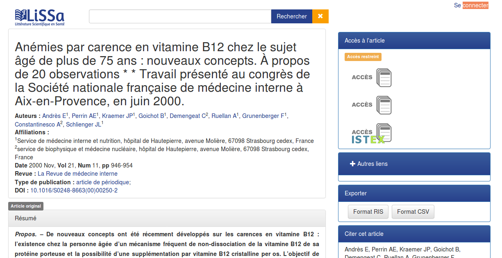

**Ils ont intégré ISTEX dans leurs outils documentaires et vous?  c'est pour bientôt ? [dites-le à l'équipe ISTEX](mailto:contact@listes.istex.fr).**

_C'est très important de savoir que la plateforme ISTEX est utilisée et de quelle façon, par la communauté._ 

## [Archive ouverte HAL](https://hal.archives-ouvertes.fr/)

- Intégration du bouton ISTEX dans les Archives ouvertes pluridisplinaires HAL
- Un grand merci à Yannick Barborini et toute son équipe pour cette intégration !

Dans HAL, la notice est enrichie avec un lien vers le texte intégral lorsque celui-ci est disponible en libre accès sur une autre plateforme comme arXiv ou PubMed Central. Le bouton d'accès ISTEX s’affiche si la ressource n’existe pas en libre accès mais est disponible sur la plateforme ISTEX (cf [billet de blog HAL](https://www.ccsd.cnrs.fr/2018/02/faciliter-acces-au-texte-integral-en-signalant-les-ressources-en-libre-acces/) et [billet de blog ISTEX](http://blog.istex.fr/une-nouvelle-integration-du-bouton-istex-hal/))

[Voir la documentation technique](https://doc.istex.fr/users/integration/ent-web/#bouton-istex-integre)

## [CHU Rouen Normandie](http://www.lissa.fr)

- Intégration du bouton ISTEX dans la base de données bibliographiques en santé LiSSa
- Un grand merci à Gaétan Kerdelhué et Julien Grosjean pour cette intégration !

[Voir la documentation technique](https://doc.istex.fr/users/integration/ent-web/#bouton-istex-integre)

##[INRA](https://www6.inra.fr/reselec)

 
- Intégration du bouton ISTEX dans un parseurv2 créé dans SFX résolveur de liens de Reselec, portail en IST des ressources électroniques de l'INRA
- Un grand merci à Odile Viseux pour cette intégration !

[Voir la documentation technique](https://doc.istex.fr/users/integration/discovery-tools/#2-parametrage-du-resolveur-sfxv2-vers-la-plateforme-istex)

## [Université Aix Marseille](https://bu.univ-amu.fr/)

- Intégration du bouton ISTEX dans un résolveur de liens SMASH pour une solution de découverte"Summon"
- Un grand merci à Laurent Lhuillier pour cette intégration !

[](http://sh2hh6qx2e.search.serialssolutions.com/?url_ver=Z39.88-2004&ctx_ver=Z39.88-2004&rfr_id=info%3Asid%2Fzotero.org%3A2&rft_id=info%3Adoi%2F10.1002%2Fanie.201306656&rft_val_fmt=info%3Aofi%2Ffmt%3Akev%3Amtx%3Ajournal&rft.genre=article&rft.atitle=Enantioselective%20Organocatalytic%20Multicomponent%20Synthesis%20of%202%2C6-Diazabicyclo%5B2.2.2%5Doctanones&rft.jtitle=Angewandte%20Chemie%20International%20Edition&rft.stitle=Angew.%20Chem.%20Int.%20Ed.&rft.volume=52&rft.issue=52&rft.aufirst=Maria%20del%20Mar&rft.aulast=Sanchez%E2%80%85Duque&rft.au=Maria%20del%20Mar%20Sanchez%E2%80%85Duque&rft.au=Olivier%20Basl%C3%A9&rft.au=Yves%20G%C3%A9nisson&rft.au=Jean-Christophe%20Plaquevent&rft.au=Xavier%20Bugaut&rft.au=Thierry%20Constantieux&rft.au=Jean%20Rodriguez&rft.date=2013-12-23&rft.pages=14143-14146&rft.spage=14143&rft.epage=14146&rft.issn=1521-3773&rft.language=en)

[Code source disponible sur GitHub](https://github.com/SCD-Aix-Marseille-Universite/SMASH/blob/master/resolver.js#L726-L746)

## [Université Jean Monnet St Etienne](https://catalogue-brisees.univ-st-etienne.fr/accueil.html#) 

- Intégration du bouton ISTEX dans le portail des ressources des bibliothèques de l'enseignement supérieur de Saint Etienne BRISE-ES et Intégration profonde de l'API par opposition aux widgets prêtes à l'emploi
- Un grand merci à Dominique Rouger pour cette intégration !

En recherchant un article dans le BRISE-ES, le portail des ressources des bibliothèques de l'enseignement supérieur de Saint Etienne, on a le lien vers un document ISTEX au niveau du catalogue et les résultats uniquement dans ISTEX.
 

[Voir la documentation technique](https://doc.istex.fr/users/integration/ent-web/#bouton-istex-integre)

##[Université Paris Saclay](https://focus.universite-paris-saclay.fr/primo-explore/search?vid=33PUP_VU1&lang=fr_FR&sortby=rank)

- Intégration du bouton ISTEX dans l'outil de découverte Primo, renommé FOCUS àl'Université Paris-Saclay
- Un grand merci à Camille Maze et son équipe pour cette intégration !

[Code source disponible sur GitHub](https://github.com/istex/istex-button-primo)

## [Université Paris Sciences Lettres](https://explore.univ-psl.fr/fr/page/loutil-de-recherche) 

- Création d'un parseurv1 dans SFX pour intégration d'ISTEX dans un outil découverte Primo du portail PSL-Explore
- Un grand merci à Laurent Aucher pour cette intégration !

_Cliquer sur RESSOURCE EN LIGNE_

=screening%20of%20170%20Peruvian%20plant%20species%20for%20allelopathic%20activity%20by%20using%20the%20Sandwich%20Method&dstmp=1524058289966)

[Voir la documentation technique](https://doc.istex.fr/users/integration/discovery-tools/#1-parametrage-du-resolveur-sfxv1-vers-la-plateforme-istex)

 
## [Université Rennes2](https://www.bu.univ-rennes2.fr)

- Intégration du bouton ISTEX dans un parseurv2 créé dans SFX
- Un grand merci à Julien Sicot pour cette intégration !

[Code source disponible sur GitHub](https://github.com/jsicot/sfxbur2)

